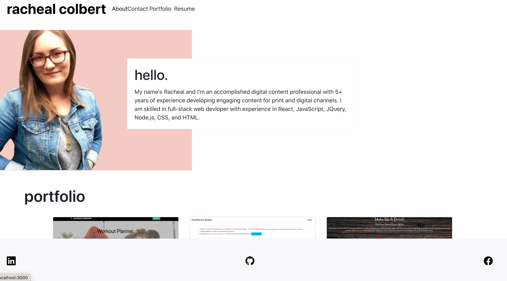

# React Portfolio

A React portfolio of my work.

**Link to GitHub Repo:** https://github.com/rachealcolbert/portfolio2

**Link to Deployed Site:** https://github.com/rachealcolbert/portfolio2

**Screenshot of Application:** https://rachealcolbert.github.io/portfolio2/

## Description

A single-page application portfolio for a web developer that contains a header, a section for content, and a footer.

When a user clicks on a navigation title, they are presented with the corresponding section below the navigation without the page reloading and that title is highlighted.

The Portfolio section includes titled images of six of the developer’s applications with links to both the deployed applications and the corresponding GitHub repository.

The Contact section features contact form with fields for a name, an email address, and a message.

## Credits

The creator of this project's email and GitHub is below.

- [GitHub](https://github.com/rachealcolbert)
- rachealcolbert16@gmail.com

## Contributing

No contributions are needed on this project.
